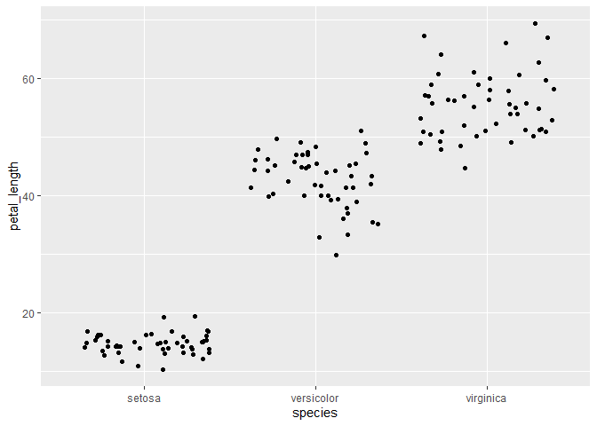
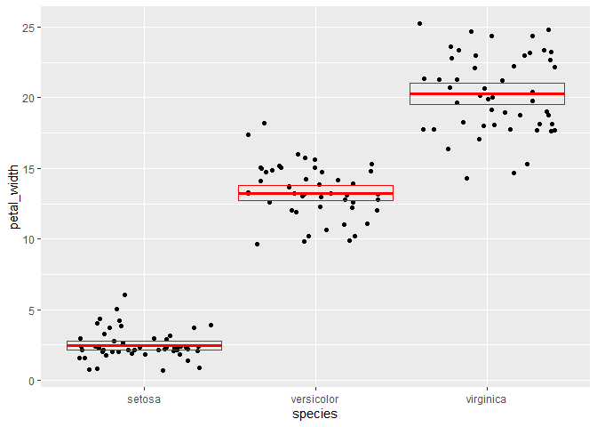

Lab 5 Assignment
================
Alec White
2021-02-23

``` r
#load packages
library(tidyverse)    
```

    ## -- Attaching packages --------------------------------------- tidyverse 1.3.0 --

    ## v ggplot2 3.3.3     v purrr   0.3.4
    ## v tibble  3.0.4     v dplyr   1.0.2
    ## v tidyr   1.1.2     v stringr 1.4.0
    ## v readr   1.4.0     v forcats 0.5.0

    ## -- Conflicts ------------------------------------------ tidyverse_conflicts() --
    ## x dplyr::filter() masks stats::filter()
    ## x dplyr::lag()    masks stats::lag()

``` r
#iris data set pakages
iris <- as_tibble(iris) # so it prints a little nicer
```

Rename each variable so that it is all lower-case and uses an underscore
\_ instead of a period . in the name (the recommended coding style in
the tidyverse style guide). Print the resulting table.

``` r
# Question 1

iris
```

    ## # A tibble: 150 x 5
    ##    Sepal.Length Sepal.Width Petal.Length Petal.Width Species
    ##           <dbl>       <dbl>        <dbl>       <dbl> <fct>  
    ##  1          5.1         3.5          1.4         0.2 setosa 
    ##  2          4.9         3            1.4         0.2 setosa 
    ##  3          4.7         3.2          1.3         0.2 setosa 
    ##  4          4.6         3.1          1.5         0.2 setosa 
    ##  5          5           3.6          1.4         0.2 setosa 
    ##  6          5.4         3.9          1.7         0.4 setosa 
    ##  7          4.6         3.4          1.4         0.3 setosa 
    ##  8          5           3.4          1.5         0.2 setosa 
    ##  9          4.4         2.9          1.4         0.2 setosa 
    ## 10          4.9         3.1          1.5         0.1 setosa 
    ## # ... with 140 more rows

``` r
i2 <-rename(iris, sepal_length = Sepal.Length,
       sepal_width = Sepal.Width,
       petal_length = Petal.Length,
       petal_width = Petal.Width,
       species = Species)
```

Convert the four numerical variables from cm to mm by multiplying by 10.
Print the resulting table.

``` r
#question 2

ni2 <-mutate(i2, sepal_length = sepal_length * 10,
       sepal_width = sepal_width * 10,
       petal_length = petal_length * 10,
       petal_width = petal_width * 10)
```

Calculate sepal area and petal area (area is equal to length multiplied
by width). Print a table with only the variables sepal area, petal area,
and species.

``` r
#question 3

ia1 <-mutate(ni2, sepal_area = sepal_length * sepal_width,
       petal_area = petal_length * petal_width)

select(ia1, petal_area, sepal_area)
```

    ## # A tibble: 150 x 2
    ##    petal_area sepal_area
    ##         <dbl>      <dbl>
    ##  1         28       1785
    ##  2         28       1470
    ##  3         26       1504
    ##  4         30       1426
    ##  5         28       1800
    ##  6         68       2106
    ##  7         42       1564
    ##  8         30       1700
    ##  9         28       1276
    ## 10         15       1519
    ## # ... with 140 more rows

Calculate the following statistics for the entire dataset from the sepal
length variable and print the resulting table:

sample size maximum value minimum value range median first quartile (q1)
third quartile (q2) inter-quartile range (iqr)

``` r
#question 4

ques4 <-summarize(ni2, sample_size = n(), 
          max = max(sepal_length),
          min = min(sepal_length),
          range = max - min ,
          median = median(sepal_length),
          q1 = quantile(sepal_length, probs = 0.25),
          q3 = quantile(sepal_length, probs = 0.75),
          iqr = q3-q1)

ques4
```

    ## # A tibble: 1 x 8
    ##   sample_size   max   min range median    q1    q3   iqr
    ##         <int> <dbl> <dbl> <dbl>  <dbl> <dbl> <dbl> <dbl>
    ## 1         150    79    43    36     58    51    64    13

Calculate the following statistics for each species from the petal width
variable and print the resulting table:

sample size mean standard deviation variance standard error of the mean
approximate 95% confidence interval

``` r
#question 5

ni2_grouped <-group_by(ni2, species)

ques5 <-summarize(ni2_grouped, sample_size = n(),
          petal_mean = mean(petal_width),
          st_dev = sd(petal_width),
          width_variance = var(petal_width),
          sem = sd(petal_width) / sqrt(sample_size),
          upper_ci = mean(petal_width) + 1.96 * sem,
          lower_ci = mean(petal_width) - 1.96 * sem)
```

    ## `summarise()` ungrouping output (override with `.groups` argument)

``` r
ques5                           
```

    ## # A tibble: 3 x 8
    ##   species   sample_size petal_mean st_dev width_variance   sem upper_ci lower_ci
    ##   <fct>           <int>      <dbl>  <dbl>          <dbl> <dbl>    <dbl>    <dbl>
    ## 1 setosa             50       2.46   1.05           1.11 0.149     2.75     2.17
    ## 2 versicol~          50      13.3    1.98           3.91 0.280    13.8     12.7 
    ## 3 virginica          50      20.3    2.75           7.54 0.388    21.0     19.5

Visualize the relationship between petal width and species using a strip
plot.

``` r
#question 6

ggplot(data = ni2) +
        geom_jitter(mapping = aes(x = species, y = petal_length))
```

<!-- -->

Starting with the previous graph, add the mean and 95% confidence
interval for each species

``` r
#question 7

width_summary <-
        summarise(
                ni2_grouped, 
                petal_mean = mean(petal_width),
                sem = sd(petal_width) / sqrt(n()),
                upper_limit =  petal_mean + 1.96 * sem,
                lower_limit =  petal_mean - 1.96 * sem
        )
```

    ## `summarise()` ungrouping output (override with `.groups` argument)

``` r
width_summary
```

    ## # A tibble: 3 x 5
    ##   species    petal_mean   sem upper_limit lower_limit
    ##   <fct>           <dbl> <dbl>       <dbl>       <dbl>
    ## 1 setosa           2.46 0.149        2.75        2.17
    ## 2 versicolor      13.3  0.280       13.8        12.7 
    ## 3 virginica       20.3  0.388       21.0        19.5

``` r
ggplot(data = ni2) +
        geom_jitter(mapping = aes(x = species, y = petal_width)) +
        geom_crossbar(
                data = width_summary,
                mapping = aes(
                        x = species,
                        y = petal_mean,
                        ymax = upper_limit,
                        ymin = lower_limit
                ),
                color = "red"
        )
```

<!-- -->

Visualize the relationship between petal length, petal width, and
species using a scatterplot. Map the two numerical variables to the x
and y axes and map species to the color and shape aesthetics.

``` r
#question 8

ggplot(data = ni2) +
        geom_point(mapping = aes(x = petal_length, y = petal_width, color = species), alpha = 0.5)
```

<!-- -->
